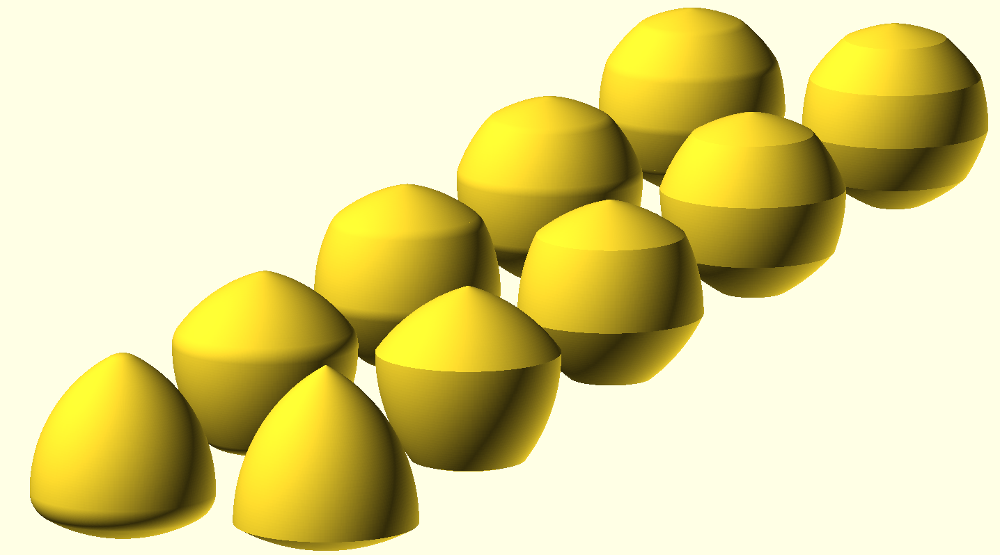

# Constant width solid

Simple module for generate constant width solid [1] based on regular polygons
[2]. You can choose the number of vertices of the regular polygon, the final
with of the solid and a rounding radius. The chosen width kept constant besides
other parameters, ie both `constant_width_solid(3, 50, 0)` and
`constant_width_solid(3, 50, 10)` have the same width.

[1]: https://en.wikipedia.org/wiki/Surface_of_constant_width
[2]: https://en.wikipedia.org/wiki/Reuleaux_triangle
